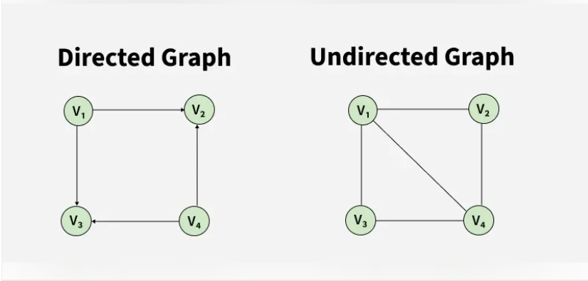
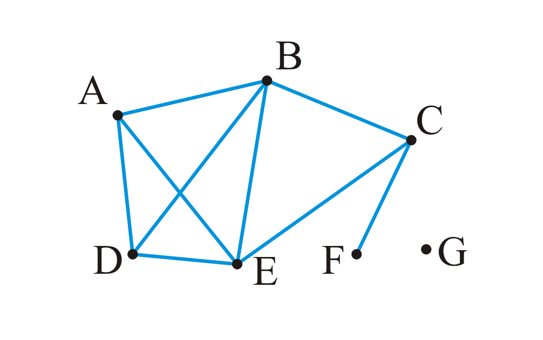
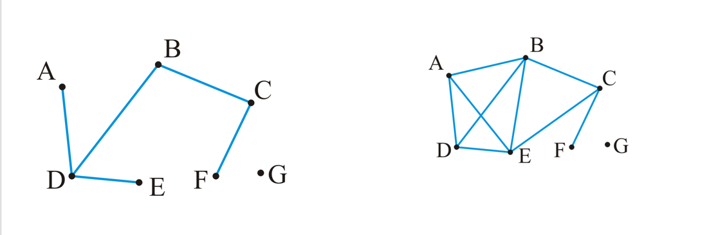
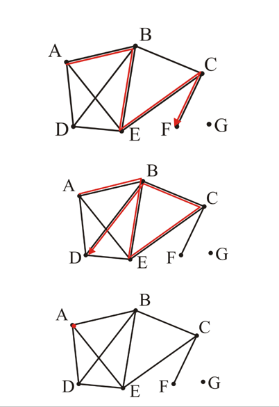
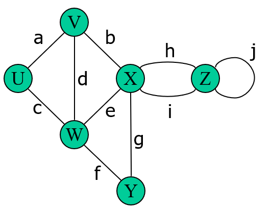

# Introduction to Graph

Graph is a **non-linear data structure**, similar to trees.  
A graph is composed of a set of **vertices (V)** and a set of **edges (E)**.  
Vertices are connected to each other through edges.

---

## Basic Terminology

- **Vertices (Nodes):** individual elements of the graph  
- **Edges (Links):** connections between vertices  

---

## Formal Definition

A graph is defined as:

G = (V, E)

Where:
- **V** is a set of vertices  
  - V = {v1, v2, v3, ..., vn}
- **E** is a set of edges connecting pairs of vertices  

---

## Types of Graphs

### Directed vs Undirected Graph

  

### Directed Graph

A **directed graph** is a graph where edges have a **direction**.

- Edges are represented as **ordered pairs (u, v)**
- This means there is a connection **from u to v**
- (u, v) ≠ (v, u)

👉 Example:
- One-way streets 🚗 (you can go only one direction)

---

### Undirected Graph

An **undirected graph** is a graph where edges have **no direction**.

- Edges are represented as **unordered pairs {u, v}**
- Connection goes both ways

👉 Example:
- Friendship networks 🤝 (if A is connected to B, B is connected to A)

---

### Key Differences

| Feature | Directed Graph | Undirected Graph |
|--------|--------------|----------------|
| Edge type | Ordered (u, v) | Unordered {u, v} |
| Direction | Yes → | No |
| Example | One-way road | Two-way road |

---

### Maximum Number of Edges

- Undirected graph:
  - max edges = n(n − 1) / 2  

- Directed graph:
  - max edges = n(n − 1)  

👉 Directed graphs can have **twice as many edges**

---

## Applications of Graphs

Graphs are used in many real-world systems:

- 🌐 Social networks (users connected to each other)  
- 💻 Computer networks  
- 📍 GPS and maps (locations and routes)  
- 🧠 Recommendation systems  

---

## Degree of a Vertex

The **degree** of a vertex is the number of adjacent vertices connected to it.

- degree(A) = degree(C) = degree(D) = 3  
- degree(B) = degree(E) = 4  
- degree(F) = 1  
- degree(G) = 0  

Vertices connected to a given vertex are called its **neighbors**.

  

---

## Subgraph

A **subgraph** of a graph is formed by taking a **subset of vertices** and a **subset of edges** from the original graph.

- The edges must connect the selected vertices  
- It is basically a **smaller graph inside the original graph**

  

---

## Spanning Subgraph

A **spanning subgraph** is a subgraph that contains **all the vertices** of the original graph,  
but may have fewer edges.

---

## Paths

A **path** in an undirected graph is an ordered sequence of vertices:

(v₀, v₁, v₂, ..., vₖ)

such that each pair (vⱼ₋₁, vⱼ) is an edge.

- A path from v₀ to vₖ  
- The **length** of the path = number of edges = k  

### Examples

- Path of length 4: (A, B, E, C, F)  
- Path of length 5: (A, B, E, C, B, D)  
- Trivial path: (A)

  

---

## Simple Path

A **simple path** is a path that has **no repeated vertices**  
(except possibly the first and last vertices in the case of a cycle).

### Examples

  

- P0 = (U, V, W, U)  
- P1 = (U, W, Y)  
- P2 = (U, V, X, Y)  
- P3 = (U, V, W, X, V, W, Y)

- P0, P1, and P2 are **simple paths**
- P3 is **not a simple path** (repetition of vertices)

---

## Simple Cycle

A **simple cycle** is a simple path of at least two vertices where  
the **first and last vertices are the same**.

Example:
- (U, V, W, U)

---

## Additional Concepts

- **Parallel edges:** multiple edges connecting the same pair of vertices  
- **Self-loop:** an edge that connects a vertex to itself  

---

## Connectedness

Two vertices \(v_i\) and \(v_j\) are said to be **connected** if there exists a path from \(v_i\) to \(v_j\).

A graph is **connected** if there exists a path between **every pair of vertices**.

  

- Left: Connected graph ✅  
- Right: Unconnected graph ❌  

---

## Weighted Graphs

A **weighted graph** is a graph where each edge has an associated **weight**.

- The weight can represent:
  - distance 📍  
  - cost 💰  
  - time ⏱️  
  - energy ⚡  

  

### Path Length in Weighted Graph

The **length of a path** is the **sum of the weights** of all edges in the path.

Example:

- Path (A → D → G)  
- Length = 5.1 + 3.7 = 8.8  

---

## Trees

A graph is a **tree** if:
- it is **connected**
- there is a **unique path between any two vertices**

  

---

### Properties of Trees

- Number of edges:
  - |E| = |V| - 1  

- A tree is **acyclic** (contains no cycles)

- Adding one edge → creates a **cycle**

- Removing one edge → splits the graph into **two disconnected subgraphs**

---

## Rooted Trees

Any tree can be converted into a **rooted tree** by:

1. Choosing a vertex as the **root**
2. Defining its neighbors as its **children**
3. Recursively defining children for each node

  

---

## Forests

A **forest** is a graph with **no cycles**.

- A tree is a **connected forest**

- A forest may have multiple connected components (trees)

---

### Properties of Forests

- Number of edges:
  - |E| < |V|

- Number of trees:
  - |V| - |E|

- Removing an edge → increases number of trees

  

---

## In-Degree and Out-Degree (Directed Graphs)

In a **directed graph**, the concept of degree is divided into two types:

- **Out-degree:** number of edges going **out of a vertex**
- **In-degree:** number of edges coming **into a vertex**

### Example

- in-degree(v₁) = 0, out-degree(v₁) = 2  
- in-degree(v₅) = 2, out-degree(v₅) = 3  

  

---

## Directed Acyclic Graph (DAG)

A **Directed Acyclic Graph (DAG)** is a directed graph that has **no cycles**.

- No path starts and ends at the same vertex following direction
- Commonly used in:
  - task scheduling  
  - dependency graphs  
  - build systems  

  

### Not a DAG

A directed graph that contains a **cycle** is NOT a DAG.

  

---